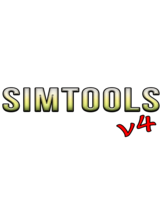

[](https://github.com/dbrown1986/SimTools/actions/workflows/build.yml)

> A desktop utility for fans of The Sims and SimCity series. SimTools brings together GPU configuration tools, game tweaks, mod framework setup, and directory management into a single, easy-to-use application — available in 9 languages.

---

## Table of Contents

- [Overview](#overview)
- [Features](#features)
- [What Do You Get?](#what-do-you-get)
- [Tools](#tools)
- [Tweaks](#tweaks)
- [Modding Tools](#modding-tools)
- [Bug Fixes](#bug-fixes)
- [Donor Personalization](#donor-personalization)
- [Advertisement Dock](#advertisement-dock)
- [Seasonal Theming](#seasonal-theming)
- [Supported Games](#supported-games)
- [Compatibility](#compatibility)
- [Requirements](#requirements)
- [Installation](#installation)
- [Companion Applications](#companion-applications)
- [Building from Source](#building-from-source)
- [Localisation](#localisation)
  - [Supported Languages](#supported-languages)
  - [Language File Format](#language-file-format)
  - [Adding a New Language](#adding-a-new-language)
- [Project Structure](#project-structure)
- [Configuration File](#configuration-file)
- [Technical Notes](#technical-notes)
- [Contributing](#contributing)
- [Patreon Support](#patreon-support)
- [Easter Eggs](#easter-eggs)
- [AI Usage](#ai-usage)
- [License](#license)

---

## Overview

SimTools is a Windows desktop application built with WPF (.NET 8) that serves as a one-stop toolkit for players of the Sims and SimCity game series. Many of these games are years or decades old and require manual configuration steps — such as editing graphics rules files or installing compatibility patches — that are not obvious to average users. SimTools simplifies this by providing guided downloads, clear instructions, and direct links to the right tools for each game.

Due to the use of WPF, support is limited to Windows. At this time, no plans exist to port the project to Linux or MacOS, though I encourage other developers to take the first step in doing so, if they please.

SimTools was previously known as **TS3Tools**, and while its roots are firmly in The Sims 3, the scope has since expanded to cover a wide range of Maxis titles across both The Sims and SimCity franchises. The application is fully localised, supports right-to-left layouts for Arabic, and stores all user preferences in a plain-text INI file that sits alongside the executable.

The project has grown beyond a single application: SimTools now ships alongside a dedicated **Installer**, **Uninstaller**, and **Updater**, each a standalone WinForms executable with its own multilingual wizard interface.

---

## Features

SimTools offers a comprehensive set of tools, fixes, and guides for getting the most out of your Sims installations:

- **Update GPU Graphics Rules** — Add support for newer graphics cards to the game engine so the game correctly identifies and leverages your hardware.
- **nRaas Tweaks** — Install nRaas core mods to mitigate in-game script errors and provide greater debugging control over the game engine.
- **Ultimate ASI Loader** — A packaged DLL file that will allow loading ASI's into Retail, Steam or EA App copies of The Sims 3
- **Sims 3 Settings Setter (S3SS)**  — An ASI file that allows for manipulating engine settings from within the game in real-time. S3SS also solves the Alder Lake CPU issue, as well as including its own Smooth Patch.
- **DXVK** — A Direct3D-to-Vulkan translation layer that replaces the legacy GPU Addon tool, with the GPU Addon still offered as a fallback for unsupported graphics cards.
- **UI Resolution Scaling** — Stretch the in-game UI to fit FHD (1440p) and UHD (2160p) resolutions using the TinyUI Fix PowerShell utility.
- **Katy Perry Sweet Treats Migration** — Migrate Katy Perry's Sweet Treats from EA to Steam or Retail without losing your content.
- **Expansion & Stuff Pack Deals** — Find various exclusive deals on expansions and stuff packs.
- **Official Patches** — Install patches for the Base Game through to Outdoor Living Stuff (Retail installations only).
- **Simler90's Engine Tweaks** — Install a curated set of engine-level tweaks and fixes authored by Simler90 to reduce lag and resolve long-standing issues.
- **108 Gameplay Fix Mods** — Install a growing collection of individual gameplay fixes across the Base Game, every Expansion Pack, every Stuff Pack, Store items, and a Probationary section for fixes still in testing — with more added in future versions.
- **Regul's Save Cleaner** — Install and run Regul's Save Cleaner to debloat saves and keep your game running smoothly over long playthroughs.
- **Curated Mod Browser** — View and download various curated and recommended mods from within the application.
- **Daily Deal Guide** — In-depth guide to obtaining Store items at the best price using the Daily Deal rotation spreadsheet.
- **Fixes & Tweaks for SimCity titles** — SimTools now includes fixes and tweaks for the SimCity titles, Streets of SimCity & SimCopter!
- **Background Music Player** — An optional in-app music player docked beside the main window, with playlist support, skip controls, and an automatic first-run download prompt.
- **Donor Personalization** — Encrypted, machine-locked donor recognition with a dedicated Exclusive Items window. See [Donor Personalization](#donor-personalization) below.

The following features/tools have been deprecated, but are still included for posterity, or as alternatives in the event users experience issues with newer innovations:

- **Alder Lake CPU Support** — Install a patch for Intel Alder Lake CPU users who experience immediate crashes to desktop due to the game's incompatibility with hybrid core architectures.
- **Lazy Duchess' Smooth Patch & Enhanced Launcher** — Install engine tweaks for faster CAS loading, reduced lag, and an enhanced EA 1.69 launcher with ASI Loading and CC disable features.
- **Game Config Guides** — Follow comprehensive guides to manually tweak game configuration files and allow the engine to harness more power from your system.
- **Loading Optimisation** — Find the best in-game settings to speed up loading into neighbourhoods and reduce lot placement times.

---

## What Do You Get?

Installing every tweak and bugfix SimTools has to offer results in a noticeably improved game experience:

- ⚡ **Faster world loading** from the main menu
- ⚡ **Faster lot placement loading**
- ⚡ **Quicker CAS entry** — loading into Create-A-Sim is significantly faster
- ⚡ **Faster CAS clothing browsing** — loading and scrolling through clothing items is smoother
- 🛡️ **Improved stability** — nRaas ErrorTrap and Overwatch will attempt to intercept and stop erroring scripts before they crash your game
- 🔧 **Fewer bugged items** — the included fix mods address a wide range of broken items, missed developer oversights, and broken interactions

---

## Tools

| Tool | Description |
|---|---|
| **DXVK** | DXVK operates as a translation layer that intercepts Direct3D API calls from Windows applications and converts them to their Vulkan equivalents in real-time. Replaces the TS3 GPU Addon Tool (kept installed alongside it as a fallback for unsupported GPUs). |
| **Regul Save Cleaner** | Keeps saves in check by scanning for and removing save bloat that accumulates over time, helping maintain game performance in long-running saves. |
| **Mod Framework** | A vetted and prepared version of the TS3 Mod Framework, specifically configured for use with SimTools to ensure maximum compatibility. |
| **7-Zip Extraction (S3Dash)** | S3Dash is distributed as a `.7z` archive; SimTools downloads and extracts it in-app using SharpCompress before launching it directly from the Binaries folder. |

Every install/download-based tool in SimTools now supports **in-place removal** — if a tool is already installed, clicking its menu entry again offers to cleanly uninstall it instead of re-downloading.

---

## Tweaks

| Tweak | Description |
|---|---|
| **Alder Lake Patcher** | Patches the game executable to run on Intel Alder Lake CPUs, which otherwise cause immediate crashes to desktop due to the game's incompatibility with hybrid core scheduling. |
| **Simitone** | Alternative C# Windows Frontend for The Sims 1, based off of FreeSO. Works with Complete Collection and Legacy Edition. |
| **Sims2RPC / Sims 2 Extender** | Sims2RPC and Extender are included for Retail/Ultimate Collection and Legacy Edition. |
| **AnimeBoom's Performance Guide** | An extensive guide on how to make The Sims 3 run smoother. |
| **Mono Patcher Library** | Includes a library of scripts so that mod authors don't have to include them in their mods. Some SimTools mods require MPL. |
| **Sims 3 Settings Setter** | An all-inclusive real-time settings adjuster that runs within the game. Includes its own smooth patch and patches Alder Lake CPU issues in sideload. |
| **nRaas Core Mods** | A set of nRaas mods included to give users greater control over debugging and engine behaviour, as well as catching and handling script errors before they cause crashes. |
| **Smooth Patch** | Engine-level tweaks by Lazy Duchess that enable faster loading into CAS and smooth out a number of other lag-inducing elements throughout the game. |
| **TinyUI Fix** | A PowerShell utility that stretches and enhances the in-game UI to properly fit FHD (1440p) and UHD (2160p) display resolutions. |
| **LazyDuchess Launcher** | An enhanced replacement launcher for EA 1.69 installations of The Sims 3, featuring ASI Loading support and the ability to disable CC directly from the launcher. |
| **Bright CAS Fix** | Tones down the overexposed lighting in the Create-A-Sim screen for The Sims 2. |
| **Sim Shadow Fix** | Fixes shadows rendering as solid black squares in The Sims 2. |
| **The Sims 2 Legacy Edition Extender** | A set of files that restore/extend functionality for the Legacy Edition release of The Sims 2. |
| **SimStreetsX, SimCopterX & SC2000X** | Compatibility layers by Krimsky for the older Maxis titles, keeping them stable on modern systems without manual CPU affinity or throttling tricks. |

---

## Modding Tools

| Tool | Description |
|---|---|
| **Create-a-World Tool 1.67 / 1.69** | EA's official Create-A-World tool for The Sims 3, used for creating and editing custom neighbourhoods and worlds. |
| **S3PE** | A package editing utility for reading, editing, and extracting resources from Sims 3 `.package` files. |
| **Sims3Pack Multi Installer** | A utility for extracting `.Sims3Pack` files down to their base elements for editing, staging, or repacking. |
| **S3Dash** | A tool for detecting conflicts and errors between installed mods, helping diagnose issues caused by incompatible packages. Downloaded as a `.7z` archive and auto-extracted by SimTools. |
| **ShowtimeCE** | A conversion utility for converting the Showtime Collector's Edition content (a guide for now, but will be fleshed out). |

---

## Bug Fixes

SimTools ships with several categories of fixes:

### Simler90's Engine Tweaks
A collection of low-level engine tweaks and fixes authored by community member Simler90, targeting a range of known issues, performance regressions, and instabilities in the base game engine.

### The Sims 2 Fixes
Includes the Bright CAS Fix, the Sim Shadow Fix, and Legacy Edition Extender files — with more on the way.

### 108 Gameplay Fix Mods for The Sims 3
A curated set of **108 individual fix mods** spread across **18 categories** (with more coming in future versions), addressing:

- Broken or bugged items in the Base Game, every Expansion Pack, and every Stuff Pack
- Store-exclusive content issues
- Developer oversights that were never officially patched
- Broken interactions between Sims or between Sims and objects
- Compatibility issues between specific content items

Categories include the Base Game, all 11 Expansion Packs (World Adventures through Into the Future), all 9 Stuff Packs (High-End Loft through 70s, 80s & 90s), Store Fixes, and a **Probationary** section for fixes still being validated by the community before graduating to their permanent category.

Each fix mod is listed individually in the included Gameplay Fixes window, so you can review exactly what each one addresses before installing — and can just as easily remove any fix that no longer suits your setup. Only install fixes for Expansion Packs and Store content you actually have installed.

### SimStreetsX, SimCopterX & SC2000X
Built by Krimsky, these are compatibility layers for the older maxis games that ensure they run more stable on modern systems and operating systems. No more setting affinity manually or throttling the CPU!

---

## Donor Personalization

Users who support the project through Patreon can unlock a personalised experience:

- A welcome banner on the introductory page addressed to the donor by name
- Access to a dedicated **Exclusive Items** window
- Removal of the [Advertisement Dock](#advertisement-dock)

### How it works

Donor keys are AES-128 encrypted payloads generated by a separate key-generation tool and encode the donor's first and last name. When a key is entered:

1. The key is validated and decrypted **in memory only** — it is never written to the INI file or anywhere else on disk.
2. A `donor.token` file is created alongside `SimTools.exe`, containing the decoded name encrypted with an AES key **derived from the machine's Windows `MachineGuid`**.
3. On every launch, SimTools decrypts `donor.token` using the current machine's GUID. If the file was copied from another PC, the derived AES key won't match and decryption fails — personalization is reset and the user is prompted to re-enter their key on that machine.

This means donor status cannot be shared simply by copying `SimTools.ini` or `donor.token` to a friend's computer — both files together are still bound to the original machine.

### Server-side activation mirroring

An optional PHP + MySQL backend (`SimToolsApp/api/`) is included for mirroring donor activations server-side, capping each donor key to a limited number of registered machines and allowing donors to view or deactivate their own registered devices. Database credentials and the encryption cipher must be configured before use — see `SimToolsApp/api/Read.txt` for details.

---

## Advertisement Dock

Non-donor users see a small advertisement dock, anchored to the bottom-centre of the active window, that rotates through banner images fetched from the configured repository. Entering a valid donor key removes the dock immediately; it never reappears until/unless personalization is reset.

---

## Seasonal Theming

SimTools quietly decorates its main windows around a few notable dates — a four-leaf clover border around St. Patrick's Day, a Santa hat near Christmas, and animated fireworks spanning Independence Day through New Year's Eve. No configuration needed; the app checks the system date on launch and shows or hides each decoration automatically.

---

## Supported Games

SimTools covers 14 titles across The Sims and SimCity franchises.

| Series | Title |
|---|---|
| The Sims | The Sims |
| The Sims | The Sims 2 |
| The Sims | The Sims Life Stories |
| The Sims | The Sims Pet Stories |
| The Sims | The Sims Castaway Stories |
| The Sims | The Sims 3 |
| The Sims | The Sims 4 |
| The Sims | The Sims Medieval |
| SimCity | SimCopter |
| SimCity | Streets of SimCity |
| SimCity | SimCity 2000, SimCity 2000 Special Edition |
| SimCity | SimCity 3000, SimCity 3000 Unlimited |
| SimCity | SimCity 4, SimCity 4: Rush Hour, SimCity 4 Deluxe |
| SimCity | SimCity (2013), SimCity: Cities of Tomorrow (2013)  |

The majority of tools, tweaks, and fixes in the current release are focused on **The Sims 3**. Support for additional titles is planned for future versions.

---

## Compatibility

SimTools is compatible with the following Sims 3 distribution platforms:

| Platform | Supported |
|---|---|
| EA App (1.67 / 1.69) | ✅ |
| Steam (1.67) | ✅ |
| Retail (disc / retail digital) (1.67) | ✅ |

SimTools can be installed on top of an existing **1.67 or 1.69** installation. A **clean install of The Sims 3 is strongly recommended** before running SimTools for the best results.

You can run SimTools regardless of which Expansion Packs or Stuff Packs you have installed — just be mindful to only install fixes and patches for packs you actually have installed. If you disable packs, you'll need to disable or remove the fixes and mods for it as well to avoid crashes.

---

## Requirements

- **Operating System:** Windows 10 or later (64-bit recommended)
- **Runtime:** [.NET 8.0 Desktop Runtime](https://dotnet.microsoft.com/en-us/download/dotnet/8.0) — required to run the application
- **Internet Connection:** Required for first-time tool and patch downloads; not needed after files are cached locally
- **Administrative Rights:** Required — the application manifest requests elevation on launch for write access to Program Files and game directories.
- **Visual Studio 2022 or later:** Required only if building from source

- WindoVista/7/8/8.1 compatibility planned for a later release.
- I *may* dawdle with the possibility of porting to MacOS on my own, but it is not actively planned.

---

## Installation

**Installer**

1. Download the latest release installer exe from the [Releases](https://github.com/dbrown1986/SimTools/releases) page or from the SimTools site.
2. Run `SimToolsInstaller.exe` and step through the multilingual installation wizard — choose your language, accept the license, and select an install folder (e.g. `C:\Program Files\SimTools`)
3. Run `SimTools.exe` after install
4. On first launch, select your preferred language and test for best regional repository.
5. Read through the introductory page and click **Continue**
6. Open **Settings** (⚙ button, top-right) to configure your game directories

**Portable**

1. Download the latest release ZIP from the [Releases](https://github.com/dbrown1986/SimTools/releases) page
2. Extract the ZIP to a folder of your choice (e.g. `C:\Tools\SimTools\`)
3. Run `SimTools.exe`
4. On first launch, select your preferred language and regional repository
5. Read through the introductory page and click **Continue**
6. Open **Settings** (⚙ button, top-right) to configure your game directories

For the portable version, no installer is required. The ZIP version of SimTools is fully portable — all settings are written to `SimTools.ini` in the same folder as the executable.

**Uninstalling**

Run `SimToolsUninstaller.exe` from the install directory. It reads `uninstall_manifest.json` (generated during installation) to remove exactly what was installed, and presents its confirmation and status dialogs in your selected language.

---

## Companion Applications

SimTools is distributed alongside three standalone WinForms utilities, each with its own project and its own multilingual wizard UI:

| Project | Purpose |
|---|---|
| **SimToolsInstaller** | Step-by-step install wizard — license agreement, install path selection, manifest-driven file download and placement. |
| **SimToolsUninstaller** | Reads `uninstall_manifest.json` and cleanly removes every file SimTools placed on the system, with a confirmation prompt before proceeding. |
| **SimToolsUpdater** | Downloads and applies the latest release over an existing install, then optionally relaunches `SimTools.exe` when finished. |

All three share the same general design language as the main app and independently implement their own translated string tables for supported languages.

---

## Building from Source

### Clone the repository

```bash
git clone https://github.com/dbrown1986/SimTools.git
cd SimTools
```

### Solution layout

`SimTools_v4.sln` contains four projects:

| Project | Path | Output |
|---|---|---|
| `SimTools_v4` (main app) | `SimToolsApp/` | `SimTools.exe` |
| `SimToolsInstaller` | `SimToolsInstaller/` | `SimToolsInstaller.exe` |
| `SimToolsUninstaller` | `SimToolsUninstaller/` | `SimToolsUninstaller.exe` |
| `SimToolsUpdater` | `SimToolsUpdater/` | `SimToolsUpdater.exe` |

### Build with the .NET CLI

```bash
dotnet build SimTools_v4.sln --configuration Release
```

Each project's output is placed in its own `bin/Release/net8.0-windows/` folder.

### Build with Visual Studio

1. Ensure your Visual Studio has .NET 8 / .NET Core 8 modules installed.
2. Open `SimTools_v4.sln` in Visual Studio 2022 or later.
3. Select the **Release** configuration from the toolbar.
4. Set `SimTools_v4` as the Startup Project to build and run the main application, or select another project to build the installer/uninstaller/updater independently.
5. Press **Ctrl+Shift+B** to build, or **F5** to build and run.

### NuGet Dependencies (SimTools_v4 / main app)

| Package | Version | Purpose |
|---|---|---|
| `WpfAnimatedGif` | 2.0.2 | Renders the animated plumbob GIF on the splash screen and holiday fireworks |
| `NAudio` | 2.2.1 | Audio playback engine (MP3, WAV, FLAC, M4A) |
| `TagLibSharp` | 2.3.0 | ID3/metadata tag reading (artist, title, album art)|
| `SharpCompress` | 0.38.0 | 7-Zip archive extraction (used for the S3Dash tool download) |

A post-build MSBuild target (`OrganiseDependencies`) copies `NAudio*.dll`, `SharpCompress.dll`, and `ZstdSharp.dll` into a `Dependencies/` subfolder alongside the built executable, keeping the main output directory tidy.

The Installer, Uninstaller, and Updater projects use only the .NET base class library and `System.Windows.Forms` — no third-party NuGet packages.

---

## Localisation

### Supported Languages

| Code | Language | Script | Direction |
|---|---|---|---|
| `ar` | عربي (Arabic) | Arabic | Right-to-left |
| `zh` | 中文 (Chinese, Traditional) | Han | Left-to-right |
| `de` | Deutsch (German) | Latin | Left-to-right |
| `en` | English | Latin | Left-to-right |
| `es` | Español (Spanish) | Latin | Left-to-right |
| `fr` | Français (French) | Latin | Left-to-right |
| `ja` | 日本語 (Japanese) | CJK | Left-to-right |
| `pt` | Português (Portuguese) | Latin | Left-to-right |
| `ru` | Русский (Russian) | Cyrillic | Left-to-right |

Arabic is the only currently supported RTL language. When Arabic is selected, the entire main window layout flips to a right-to-left flow direction automatically.

Each `.lang` file currently defines just under 600 localised strings across roughly 30 sections, covering every window, dialog, context menu, and error message in the application.

### Language File Format

Language files use a simple INI-style format with named sections and key=value pairs. They live in the `Languages/` folder next to the executable and are plain UTF-8 text files — no compilation step is needed.

A guide to writing your own language files can be found [here](http://simtools-app.com/translations.html)

```ini
[Main]
Btn_GPU=GPU Support >
GPU_Description=Use these tools to identify and install support for your GPU.

[Messages]
Error_Title=Error
Error_OpenLink=Unable to open link: {0}

[Splash]
Loading=v 4.0.1.3868
Retic=Reticulating Splines...
```

Placeholders like `{0}` are replaced at runtime using `string.Format()`. Do not change or remove them when translating. Literal `\n` sequences (backslash followed by the letter n) are converted to real line breaks by `LanguageManager` when the string is displayed — write `\n` in your translated value wherever the English source uses one.

The following sections must be present in every language file:

| Section | Purpose |
|---|---|
| `[Main]` | Main window button labels, tweak/tool dialogs, and description text |
| `[GameplayFix]` / `[GameplayFixes]` | Gameplay Fixes window labels and the 108 individual fix descriptions |
| `[BuyTS3]` | Store/purchase link tree labels for The Sims 3 |
| `[ContextMenu]` | Right-click context menu item labels |
| `[Settings]` | Settings window labels and buttons |
| `[Personalization]` / `[ExclusiveItems]` | Donor unlock dialog and Exclusive Items window |
| `[Paths]` / `[Tweaks]` / `[ModResources]` | Game directory prompts and tweak/tool dialogs |
| `[LanguageSelectionWindow]` | Language selection window text |
| `[DownloadProgress]` / `[UpdateDL]` | Download progress window title and status text |
| `[Splash]` | Splash screen version label and typing animation text |

### Adding a New Language

1. Copy `Languages/en.lang` to `Languages/xx.lang`, where `xx` is the [ISO 639-1 language code](https://en.wikipedia.org/wiki/List_of_ISO_639-1_codes) (e.g. `it` for Italian)
2. Translate every value on the right-hand side of each `=`. **Do not change the keys or section names.**
3. Preserve all `{0}`, `{1}`, etc. placeholders and any `\n` sequences — they are substituted/converted at runtime
4. Add the language to the `Languages` array in `SettingsWindow.xaml.cs`:
   ```csharp
   ("it", "Italiano"),
   ```
5. Add a button for it in `LanguageSelectionWindow.xaml` inside the `<UniformGrid>`:
   ```xml
   <Button Content="Italiano" Tag="it" Click="Language_Click"
           Style="{StaticResource LangBtn}" Width="140" Height="35" Foreground="Black">
       <Button.Background>
           <ImageBrush ImageSource="/Images/button_normal.png"/>
       </Button.Background>
   </Button>
   ```
6. If the language reads right-to-left, add its code to the `rtlLanguages` HashSet in `IntroductoryPage.xaml.cs` and `MainWindow.xaml.cs`:
   ```csharp
   var rtlLanguages = new HashSet<string> { "ar", "xx" };
   ```
7. Rebuild the project. The new language will appear in both the language selection screen and the Settings dropdown.

---

## Project Structure

```
SimTools/
│
├── SimToolsApp/                          # Main application project
│   ├── Images/                           # Compiled into the assembly as WPF resources
│   │   ├── button_normal.png             # Default button background (grey)
│   │   ├── button_yellow.png             # Recommended action button background
│   │   ├── button_green.png              # Normal action button background
│   │   ├── button_red.png                # Highly recommended / warning button background
│   │   ├── close-button.png              # Custom close button (top-right of main window)
│   │   ├── Menu_Main.png                 # Main window background image
│   │   ├── plumbob.gif / plumbob-*.gif   # Animated plumbob (splash screen + easter eggs)
│   │   ├── advertise.png                 # Placeholder art for the Advertisement Dock
│   │   ├── SimTools_Logo.png             # Application logo
│   │   ├── Holidays/                     # St. Patrick's, Independence Day/NYE, Christmas art
│   │   ├── Icons/                        # Per-game, per-expansion, and vendor icons
│   │   └── Flags/                        # Language selection flag thumbnails
│   │
│   ├── Languages/                        # Copied to output directory alongside the .exe
│   │   ├── en.lang                       # English (base / fallback language)
│   │   ├── ar.lang                       # Arabic (RTL)
│   │   ├── zh.lang                       # Chinese (Traditional)
│   │   ├── de.lang                       # German
│   │   ├── es.lang                       # Spanish
│   │   ├── fr.lang                       # French
│   │   ├── ja.lang                       # Japanese
│   │   ├── pt.lang                       # Portuguese
│   │   └── ru.lang                       # Russian
│   │
│   ├── Pages/                            # UI windows and supporting classes
│   │   ├── IntroductoryPage.xaml(.cs)    # Welcome page, donor banner, update check, repo speed test
│   │   ├── LanguageSelectionWindow.xaml(.cs)  # 3×3 grid language picker layout
│   │   ├── MainWindow.xaml(.cs)          # Main UI layout, button handlers, context menus, download logic
│   │   ├── SplashScreenWindow.xaml(.cs)  # Transparent borderless splash screen layout
│   │   ├── GameplayFixesWindow.xaml(.cs) # 108-item, 18-category gameplay fix installer/remover
│   │   ├── GameplayFixViewModels.cs      # GameplayFixItem record + GameplayFixViewModel
│   │   ├── BuyTS3.xaml(.cs)              # Store/purchase link tree for The Sims 3
│   │   ├── BuyTreeViewModels.cs          # BuyTreeNode model used by BuyTS3
│   │   ├── MusicPlayerWindow.xaml(.cs)   # Optional docked background music player
│   │   ├── MusicPlayerService.cs         # Playback engine (NAudio) + playlist management
│   │   ├── MusicDownloadWindow.xaml(.cs) # First-run background music download prompt
│   │   ├── AdDockWindow.xaml(.cs)        # Bottom-centre rotating advertisement dock (non-donors)
│   │   ├── ExclusiveItems.xaml(.cs)      # Donor-only exclusive content window
│   │   ├── UnlockPersonalizationDialog.xaml(.cs) # Donor key entry dialog
│   │   ├── DonorKeyHelper.cs             # AES key validation + machine-locked token file logic
│   │   ├── MachineIdentity.cs            # Reads the Windows MachineGuid from the registry
│   │   ├── KeyGeneratorWindow.xaml(.cs)  # Donor key generation tool
│   │   ├── GenericKeys.xaml(.cs)         # Generic retail product key lookup
│   │   ├── SettingsWindow.xaml(.cs)      # Directory paths, language, base URL configuration
│   │   ├── GamePaths.cs / GamePathDetector.cs  # Directory variables + auto-detection logic
│   │   ├── AppSettings.cs                # Repository base URL resolution (%baseurl%)
│   │   ├── TrustedSources.cs             # Trusted domains + repository mirror list
│   │   ├── RepoValidator.cs              # Warns on untrusted/tampered repository sources
│   │   ├── ModFrameworkHelper.cs         # TS3 Mod Framework installation helper
│   │   ├── IniHelper.cs                  # Static INI reader/writer using nested Dictionary
│   │   └── LanguageManager.cs            # Static .lang file loader; Get() and Format() accessors
│   │
│   ├── Resources/                        # Fonts, product keys, music, sound effects
│   ├── api/                              # Optional PHP + MySQL donor activation mirror backend
│   ├── App.xaml / App.xaml.cs            # Startup: splash → language → intro → main window
│   ├── app.manifest                      # Requests administrator elevation on launch
│   └── SimTools_v4.csproj                # Project file (.NET 8.0-windows, UseWPF + UseWindowsForms)
│
├── SimToolsInstaller/                    # Standalone install wizard (WinForms)
├── SimToolsUninstaller/                  # Standalone uninstall wizard (WinForms)
├── SimToolsUpdater/                      # Standalone update wizard (WinForms)
│
└── SimTools_v4.sln                       # Visual Studio solution — all four projects
```

---

## Configuration File

SimTools stores all user settings in `SimTools.ini`, located in the same directory as `SimTools.exe`. The file is created automatically on first run and can be edited manually in any text editor.

```ini
[Language]
SelectedLanguage=en
DoNotAskAgain=false

[Directories]
Sims1_Game=
Sims2_Game=C:\Program Files (x86)\EA Games\The Sims 2
Sims2_Mods=C:\Users\YourName\Documents\EA Games\The Sims 2\Downloads
SimsLifeStories_Game=
SimsLifeStories_Mods=
SimsPetStories_Game=
SimsPetStories_Mods=
SimsCastawayStories_Game=
SimsCastawayStories_Mods=
Sims3_Game=C:\Program Files (x86)\Electronic Arts\The Sims 3
Sims3_Mods=C:\Users\YourName\Documents\Electronic Arts\The Sims 3\Mods
Sims4_Game=
Sims4_Mods=
SimsMedieval_Game=
SimsMedieval_Mods=
SimCopter_Game=
StreetsOfSimCity_Game=
SimCity2000_Game=
SimCity3000_Game=
SimCity4_Game=
SimCity2013_Game=
```

> **Tip:** You do not need to fill in directories for games you do not own. Empty values are simply ignored. At first run, directories may not show in the INI file until set in configuration section.

Donor personalization data is **not** stored in `SimTools.ini` — see [Donor Personalization](#donor-personalization) for why it lives in a separate, machine-locked `donor.token` file instead.

---

## Technical Notes

### WPF + WinForms Interop
SimTools uses both `UseWPF` and `UseWindowsForms` in the project file. This is necessary for the folder browser dialog (`System.Windows.Forms.FolderBrowserDialog`). Because both frameworks define types with the same names (`Button`, `MessageBox`, `Application`, `Point`, `Cursors`, `MouseEventArgs`, etc.), every affected file uses explicit `using` aliases to resolve ambiguity:

```csharp
using Button      = System.Windows.Controls.Button;
using MessageBox   = System.Windows.MessageBox;
using WpfCursors   = System.Windows.Input.Cursors;
```

### Context Menu Timing
The GPU and Tweaks context menus are built once in `ApplyLanguage()` rather than in the `ContextMenuOpening` event. This prevents a bug where left-clicking the button fires the event handler and immediately launches the first menu item.

### Download Caching
Downloaded files are stored in the `Binaries/` subfolder relative to the executable. If a file already exists at the target path, the remote file header is checked to see if it is newer, if it is not, the download step is skipped and the file is launched directly. To force a re-download, delete the file from `Binaries/`.

### Install / Remove Toggling
Most tool and mod entries in the context menus check for an existing installation before doing anything. If the target file is already present, the user is prompted to remove it instead of re-downloading — this pattern is used consistently across DXVK, Mono Patcher, nRaas mods, the Ultimate ASI Loader, Sims 3 Settings Setter, LazyDuchess Launcher/Smooth Patch, and the individual Gameplay Fix mods.

### Donor Token Machine Binding
`donor.token` is encrypted with an AES-128 key *derived from* the machine's `MachineGuid` (via SHA-256), rather than a fixed key. This means the encryption key itself changes per machine, so the same token file cannot be decrypted anywhere else — copying `SimTools.ini` and `donor.token` together to another PC is not sufficient to transfer donor status.

---

## Contributing

Contributions are welcome. If you would like to add support for a new game, tool, language, or fix mod:

1. Fork the repository
2. Create a feature branch (`git checkout -b feature/my-new-tool`)
3. Make your changes
4. Test on at least one clean Windows 10 or 11 machine
5. Submit a pull request with a clear description of what was added or changed

If you are adding a new language file, ensure all sections and keys from `en.lang` are present, even if some values are temporarily marked `(Translation needed)`.

Bug reports and feature requests can be submitted via the [Issues](https://github.com/dbrown1986/SimTools/issues) page.

---
## Patreon Support

I have coded in personalization and exclusive items for Patreon members, if you glance through the code and figure out how it works, congrats on earning free Patreon access.

## Easter Eggs

There are five hidden easter eggs within SimTools — tucked away. Props to anyone who manages to find them. If you do, there is a secret unlocked.

Hint: Four of them are clickables, so play around in the app and click on things that look out of place, hell click on EVERYTHING. The fifth is a cheat code almost as famous as the KONAMI code.

---

## AI Usage

Claude has been used in an effort to check code for warnings and errors, clean up the code, assist with new features (including the Advertisement Dock, the machine-locked donor personalization system, and localisation upkeep), and keep this README in sync with the codebase.
Google Gemini has been used for translation localization. So far, all of the translated text within the lang files and app is AI generated.

---

## License

SimTools is released under the terms described in [LICENSE.txt](LICENSE.txt). Please read it before distributing modified versions.
